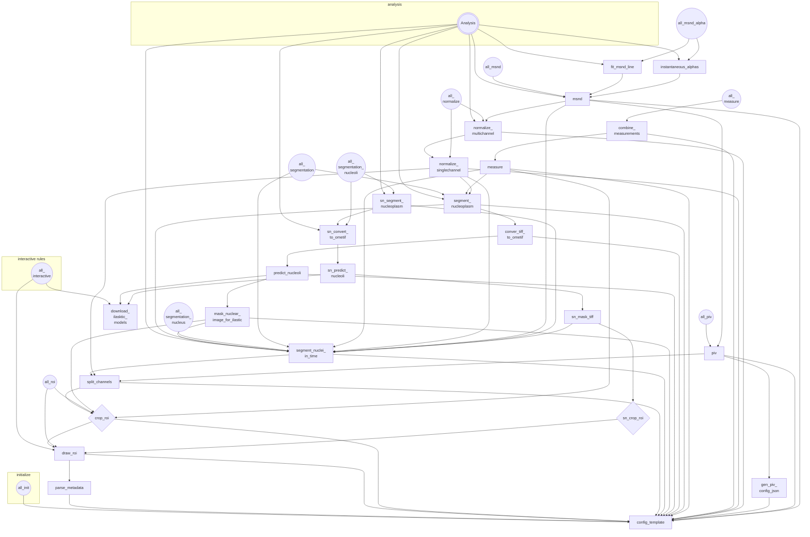

# abcpiv

PIV-based analysis for chromatin from A- or B-compartments.

---

Date started: 2023-02-02

---

## Workflow diagram
TODO: Update workflow diagram to be data-centric instead of rule-centric

🚧 Nucleoli segmentation rule is currently not very useful because
it assumes the input movies contain BFP channel which is used for
ilastik-based pixel-classification. So if attempting to target rule
`all_segmentation`, snakemake will raise a `MissingInputException` if
BFP channel isn't available.



## Dependencies

Dependencies are listed in [workflow/envs/abcdcs.yaml](workflow/envs/abcdcs.yaml) 
file and can be installed as a conda environment using either conda or
mamba. 

Currently, with mamba which is faster at solving, we need to first 
create an empty environment before we can install dependencies specified
in an yaml file. See the [issue and solution](https://github.com/mamba-org/mamba/issues/633#issuecomment-812272143).

```
mamba create -n abcdcs
mamba env update -n abcdcs -f workflow/envs/abcdcs.yaml
```  

### wget


### ilastik
Install manually before the first run. 

```
mamba create -n ilastik 
mamba activate ilastik
mamba install -c ilastik-forge ilastik
```

**TODO**: add to conda environment for snakemake to create this on the 
first run.

### MATLAB

You'll need to have `matlab` on your path. This can either be done by 
manually creating a symbolic link to the matlab executable, or by using
the environment modules on a cluster (e.g. `module load matlab/R2019b`).

Note: Do not rely on *alias*. It is fragile and likely won't work when
Snakemake execute a `shell` directive.


## Executing snakemake workflow

### On local machine
1. `conda activate abcdcs`
2. `cd` to analysis folder
3. Issue the following command to initialize the workflow:
   ```bash
   snakemake \
     -s {path/to/this/repo}/workflow/Snakefile \
     -c1 \
     init
   ```
   This will copy the [`config/config.yaml`](config/config.yaml) to the 
   analysis folder.
4. Edit the config file according to the experiment.
5. Run snakemake locally, optionally specify target rule. (See 
   [`Snakefile`](workflow/Snakefile) for possible *all*-type rules.)
   ```bash
   snakemake \
     -s {path/to/this/repo}/workflow/Snakefile \
     --configfile config.yaml \
     --use-conda \
     -c{n}
   ```

Note: If testing the repo with the test data, treat the repo folder as
the *analysis folder* mentioned above in step 2. And also no need to 
specify where the main snakemake file and configureation files are,
via `-s` and `--configfile`, respectively. 


### On della

#### Part A: Set up analysis folder
1. `cd` to analysis folder
2. Activate `abcd` conda environment by issuing `conda activate abcd`
3. Issue the following command to initialize the workflow:
   ```bash
   snakemake \
     -s {path/to/this/repo}/workflow/Snakefile \
     -c1 \
     init
   ```
   This will copy the [`config/config.yaml`](config/config.yaml) to the 
   analysis folder.
4. Edit the config file according to the experiment.

#### Part B: GUI-based work and resources download
1. Launch `della-vis1` desktop via VNC on mydella.
2. Launch terminal and `module load anaconda3/2022.10 && conda activate abcd`
3. `cd` to analysis folder, and run

```bash
snakemake \
  -s {path/to/this/repo}/workflow/Snakefile \
  --configfile config.yaml \
  --use-conda \
  --use-envmodules \
  -c1 \
  all_interactive
```

#### Part C: Run remaining rules on della using `salloc`
1. `cd` to analysis folder
2. `module load anaconda3/2022.10 && conda activate abcd`
3. `salloc --nodes=1 --ntasks=<n> --mem-per-cpu=<m>G --time=<t>` where 
   `<n>` is the number of cores to use, `<m>` is the amount of memory 
   per core, and `<t>` is the time limit.
4. Issue the following command:

```
snakemake \
  -s {path/to/this/repo}/workflow/Snakefile \
  --configfile config.yaml \
  --use-conda \
  --use-envmodules \
  -c{n} \
  all && \
scancel $SLURM_JOB_ID
```

where `{n}` is the core requested in the `salloc` command.


## Versions (note this section is outdated)

### Tagging system explanation
This repository currently contains both 
1. a snakemake workflow with its config files, scripts, etc; and 
2. a python package `abcdcs` that is required for the workflow, but also
   includes modules can be used on their own for upstream preprocessing
   as well as downstream analyses.

In the future, it might make sense to keep track of them separately, 
but currently their development is closely related. Thus, we now use a 
single tagging system for version tracking. 

The format is `yyyy.MM.dd.[a-z]` where `[a-z]` is used to differentiate
versions tagged on the same date.

- `2023.04.05.a`: Consider this `v0.0.9`!
    - include ilastik for nucleoli segmentation
    - workflow is more modular with clearer main `Snakefile`
    - directly determine raw input files to be used for rules
    - no pepfile is used anymore. just a single config file.
- `2023.03.31.a`: remove unused function in msnd
- `2023.03.30.a`: **normalize intensity for y459 and y491 on della**
- `2023.03.28.a`: **Improve raw data compatibility with tiff file without metadata**
- `2023.03.26.c`: **matpiv_v2 della (used for y459)**
- `2023.03.26.b`: snakemake on local and della up to PIV
    - Workflow runs on both local (everything to piv) and della 
      (from cropping to piv).
    - No job grouping should be used.
    - On della, if want to avoid submit many small jobs (currently some
      of the corresponding rules have time set to `61` minutes when they
      take only a few minutes, to avoid piling up in the *short-job*
      queue), `salloc` then run without cluster profile is useful. 
